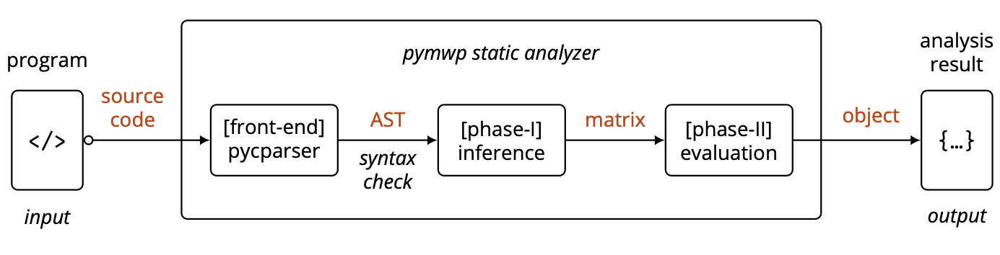

# Technical Introduction

At a high-level, pymwp reads a C file and produces an analysis result.

{ width="700" }
/// caption
Fig. 1: pymwp workflow
///

Under the hood, pymwp is built from various modules.
Each module has a specific role.
For example, `Analysis` runs program analysis (i.e., the intermediate steps between parser and output in Fig. 1); 
the `matrix` module contains matrix utilities, the `parser` is the front-end, etc.

This documentation section explains the internal behaviors of these building blocks.
Understanding these modules becomes relevant when importing pymwp in scripts.


## Scripting Examples

### Reusing analysis output

This scenario describes reusing the pymwp analysis result in further computation.

* An analysis run returns a [`Result`](result.md#pymwp.result.Result) object.
* Function [`get_func(...)`](result.md#pymwp.result.Result.get_func) returns the analysis result of the specified function.

=== "Python script"

    ``` python
    from pymwp import Analysis, Parser
    from pprint import pprint
    
    # path to file to analyze
    file = 'c_files/basics/if.c'
    
    # parses a C-langugage file using pycparser
    ast = Parser.parse(file, use_cpp=True, cpp_path='gcc')
    
    # run analysis, then access result for main function
    result = Analysis.run(ast, fin=True, no_save=True).get_func('main')
    
    # do something with the analysis result
    # display analysis result and collected data
    pprint(result.to_dict())
    ```

=== "Analysis input (if.c)"

    ``` c
    // contents of if.c
    int main(int x, int y){
        if (0) {y = x;}
    }
    ```

=== "Terminal output"

    ``` json
    {'bound': {'x': 'x;;', 'y': 'x,y;;'},
    'choices': [[[0, 1, 2]]],
    'end_time': 1725498245384529000,
    'index': 1,
    'inf_flows': None,
    'infinity': False,
    'name': 'foo',
    'relation': {'matrix': [[[{'deltas': [], 'scalar': 'm'}],
                             [{'deltas': [], 'scalar': 'm'}]],
                            [[{'deltas': [], 'scalar': 'o'}],
                             [{'deltas': [], 'scalar': 'm'}]]]},
    'start_time': 1725498245383927000,
    'variables': ['x', 'y']}
    ```

### Build with analysis modules

Working directly with the internal modules allows customizing the analysis behavior and building related analyses.

=== "Python script"

    ```python
    from pymwp import Polynomial, Monomial
    from pymwp.matrix import identity_matrix, show
    
    matrix = identity_matrix(3)
    matrix[0][1] = Polynomial('m')
    matrix[1][1] = Polynomial('w')
    matrix[2][1] = Polynomial(Monomial('p', (0, 0), (1, 1)))
    
    show(matrix)
    ```

=== "Terminal output"

    ``` txt
    [' +m', ' +m', ' +o']
    [' +o', ' +w', ' +o']
    [' +o', ' +p.delta(0,0).delta(1,1)', ' +m']
    ```
